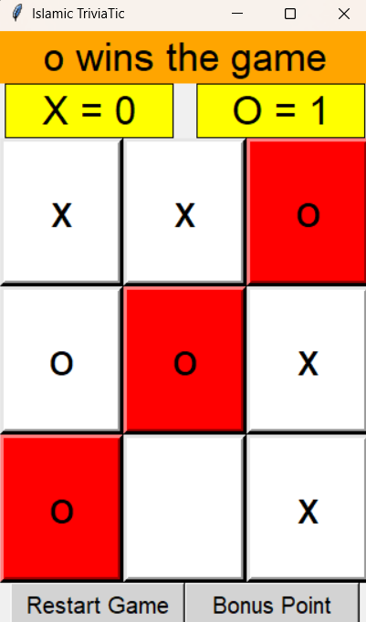

# Islamic TriviaTic Game

**Islamic TriviaTic** is an interactive Python game that combines **Islamic quizzes** with a **Tic Tac Toe game**. Users answer random True/False questions to test their Islamic knowledge, with hints available for guidance. Correct answers allow players to continue to the Tic Tac Toe challenge, which can be played **against an AI using the Minimax algorithm**.  

The game tracks scores, highlights winning combinations, and includes bonus questions for extra points. Built with **Tkinter**, it offers an engaging and educational GUI experience.

